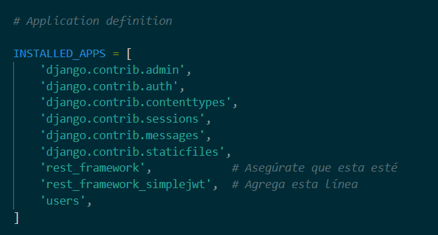
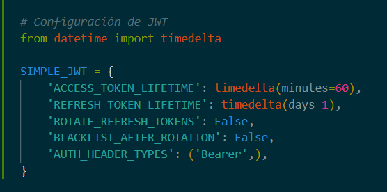
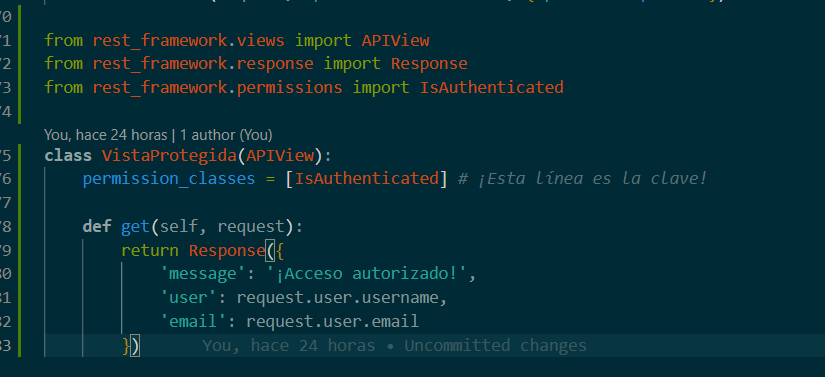
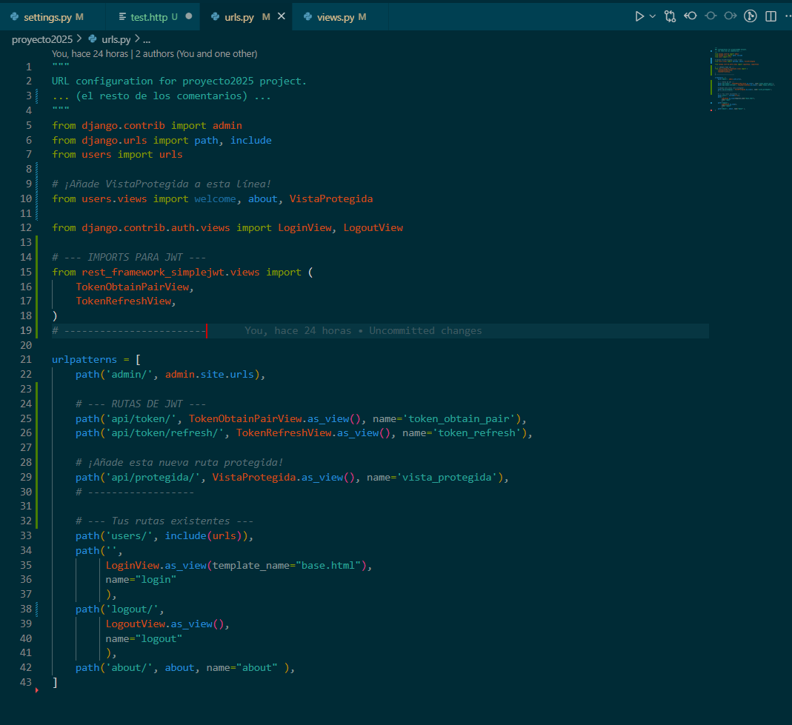

# Práctica: Implementación de JWT en Django REST Framework

Este repositorio documenta la implementación de autenticación por JSON Web Tokens (JWT) en un proyecto de Django (proyectp2025) usando djangorestframework-simplejwt.

El objetivo es asegurar endpoints de la API, permitiendo el acceso solo a usuarios que presenten un token válido.

---

## 1. Configuración del Proyecto

Se realizaron las siguientes modificaciones clave en settings.py:

### INSTALLED_APPS
Se añadieron 
est_framework y 
est_framework_simplejwt a las aplicaciones instaladas.

### Configuración de SIMPLE_JWT
Se definió el tiempo de vida de los tokens: 60 minutos para el *access token* y 1 día para el *refresh token*.

---

## 2. Creación de Endpoints

### Vista Protegida (views.py)
Se creó una VistaProtegida (en users/views.py) que usa permission_classes = [IsAuthenticated]. Esto bloquea automáticamente el acceso a menos que se provea un token JWT válido.

### Rutas (urls.py)
Se agregaron las rutas necesarias en proyecto2025/urls.py:
* /api/token/: Para que el usuario envíe sus credenciales (POST) y reciba los tokens.
* /api/protegida/: La ruta de prueba que usa la VistaProtegida.

---

## 3. Pruebas y Resultado Final

Se utilizó la extensión **REST Client** de VS Code para probar el flujo:

1.  **Login (No mostrado):** Se hizo un POST a /api/token/ con el usuario y contraseña del superusuario (dmin).
2.  **Acceso Protegido (Éxito):** Se usó el *access token* obtenido para hacer un GET a /api/protegida/, enviándolo en el *header* Authorization: Bearer ....

El servidor respondió con **HTTP/1.1 200 OK** y el JSON de éxito, confirmando que la autenticación JWT funciona correctamente.

